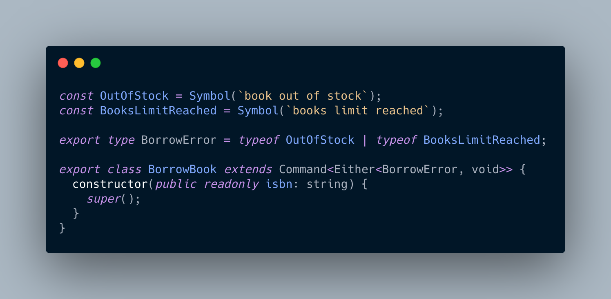
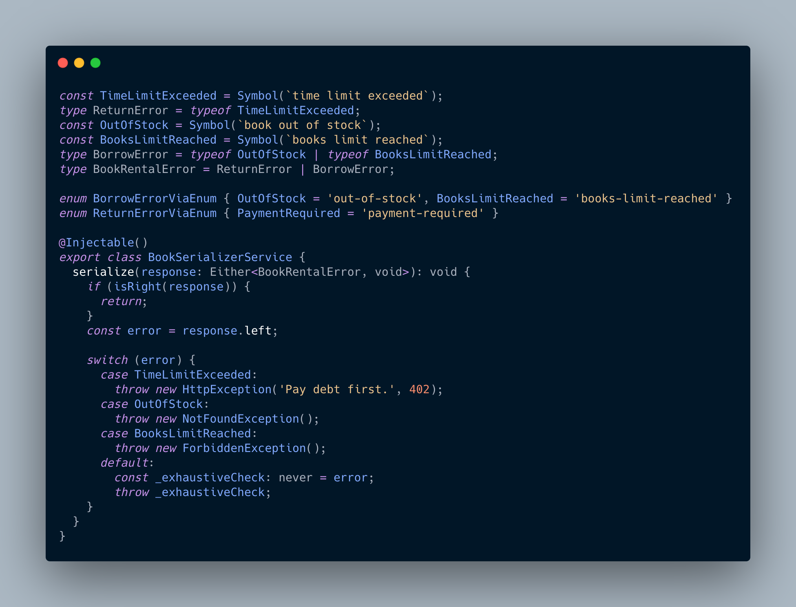

# Wyraź swoje metody!

Zachodzisz w głowę, czy i jakie błędy może zwrócić funkcja? Ułatw życie sobie i innym poprzez ekspresję intencji!

([Zobacz w praktyce!](link do repo))

# Skoro wyjątek może być wartością, to czym?

`enum`? `Symbol`? Przewagą `Symbol` jest możliwość uni typów.

